<div align="center">
<a href="https://github.com/mohamedismail37/Driving-Vehicle-Licenses-Department" rel="Title">
  
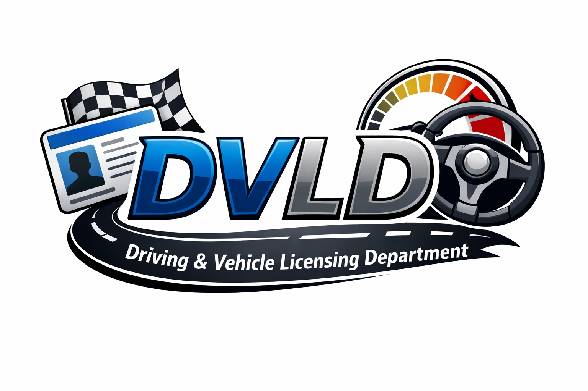
</a>
</div>

<h3 align="center">Driving Vehicle Licenses Department</h3>

### About The Project
> **DVLD** is a **C# .NET** Desktop application simulating real-world driver’s license issuance workflows

---
## Table of Contents

- [Project Description](#project-description)
  - [Overview](#overview)
  - [Objectives](#objectives)
  - [Built With](#built-with)
- [Main Features & ScreenShots](#main-features)
  - [Authentication & Account Management](#Authentication-&-Account-Management)
  - [People Management](#People-Management)
  - [Users Management](#Users-Management)
  - [Applications & Test Types](#Applications-&-Test-Types)
  - [Drivers Management](#Drivers-Management)
  - [Tests](#Tests)
  - [Licenses](#Licenses)

- [Architecture & Database Design](#architecture--database-design)
- [Technical Highlights](#Technical-Highlights)
- [File Structure](#file-structure)
- [Future Enhancements](#future-enhancements)
- [Contributers](#Contributers)


---
## Project Description

### Overview
The Driving & Vehicle Licensing Department (DVLD) is a full-stack desktop application developed using C# and .NET Framework.  
The system simulates core workflows of a real-world licensing department, including people management, user management, applications, tests, etc.  
It is built with a clear focus on clean architecture, data validation, and maintainable code structure.

### Objectives
- Apply the **3-Tier Architecture** (Presentation, Business Logic, Data Access)
- Build a real-world–like system with **complete CRUD operations**
- Practice **WinForms UI development** with proper validation and user experience
- Design a **normalized SQL Server database** with relationships and constraints

### Built With
- **C# (.NET Framework)**
- **WinForms** 
- **ADO.NET**
- **SQL Server**
- **3-Tier Architecture**
- **Git & GitHub**

---
## Main Features

### Authentication & Account Management
- Secure login system with username & password validation
- Active user check before allowing access
- “Remember Me” functionality
- Change password with validation
- View current user information (without sensitive data)
- Logout functionality

| Login | Main Screen with account setting menu |
|-------|---------------------------------------|
| 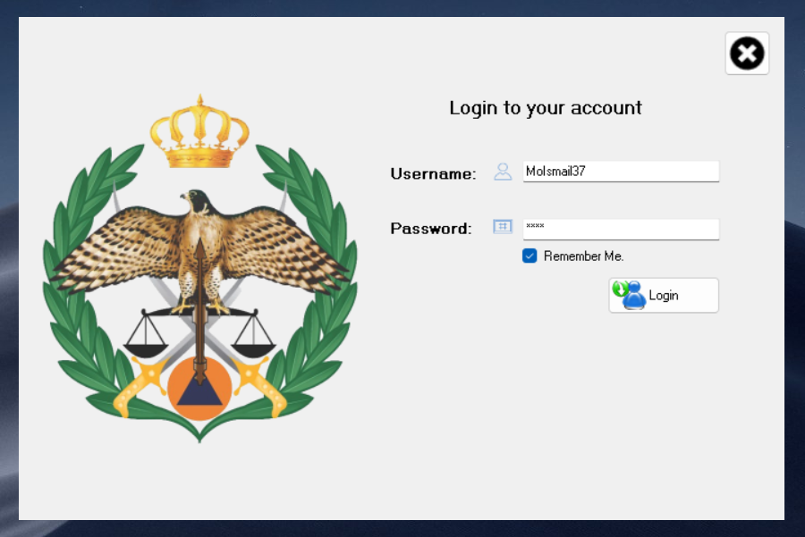 |  | 

---
### People Management
- View & List all people in a DataGridView
- Advanced filtering (Person ID, Name, Email, etc.)
- Input validation (letters-only for names, numbers-only for IDs)
- Context menu actions:
  - View person details
  - Update person information
  - Delete person (with safety checks)

| Manage People List | Context Menu |
|--------------------|--------------|
|  |  |

| All Filters | Filter applied |
|-------------|----------------|
|  |  |

| Show Person Card | Update Person Info |
|------------------|--------------------|
|  |  |

#### Add New Person:
| Validation for entities | Live validatoin with DB | 
|-------------------------|-------------------------|
|  |  |

---
### Users Management
- View all system users with filtering options
- Filter by User ID, Person ID, or Active status
- Add new users by linking them to existing people
- Prevent duplicate usernames (live database validation)
- Update user information
- Change user passwords
- Delete users only if not linked to critical data

#### Add New User:
| Find Person with filters | Fill User Info | Save Data |
|--------------------------|----------------|-----------|
|  |  |  

#### Manage Users:
| Manage Users with Filters | Context Menu | 
|---------------------------|--------------|
|  |  |

#### Update User:
| Show person Info | Update User Info | 
|------------------|------------------|
|  |  |

#### Change Password:
| Validation on previous password | Validation for new password | 
|---------------------------------|-----------------------------|
|  |  |

#### Show User Card:


---

### Applications & Test Types
- List and manage application types
- Update application settings
- List and update test types

#### Manage Test Types:
| List all Test Types | Update Test Type | 
|---------------------|--------------------|
|  |  |

#### Manage Application Types:
| Application Menu in Dashboard | List Application Types | 
|-------------------------------|------------------------|
| 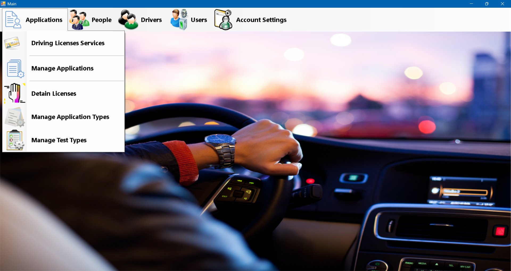 |  |

| Context Menu | Update Application Type | 
|--------------|-------------------------|
|  |  |

---
### Drivers Management
- View all Drivers with filtering options
- Filter by Driver ID, Person ID, or National No.
- The Driver had been created automatically when he issued a license for the first time
- Can see through the list table the Driver(person) info
- Also, can see his license history 

#### Manage Drivers:
| Manage Drivers | Search Filters | Context Menu Stripe |
|----------------|----------------|---------------------|
| 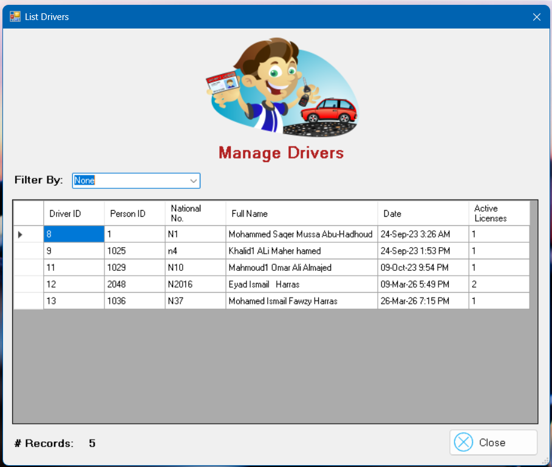 | 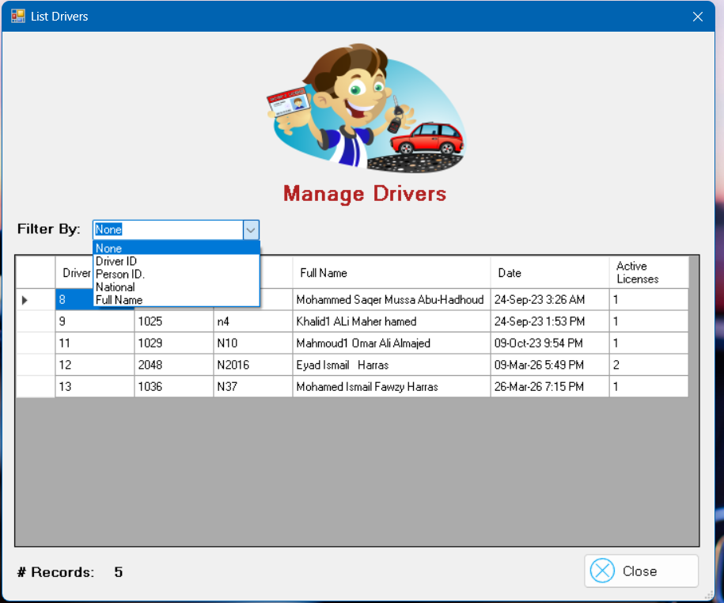 | 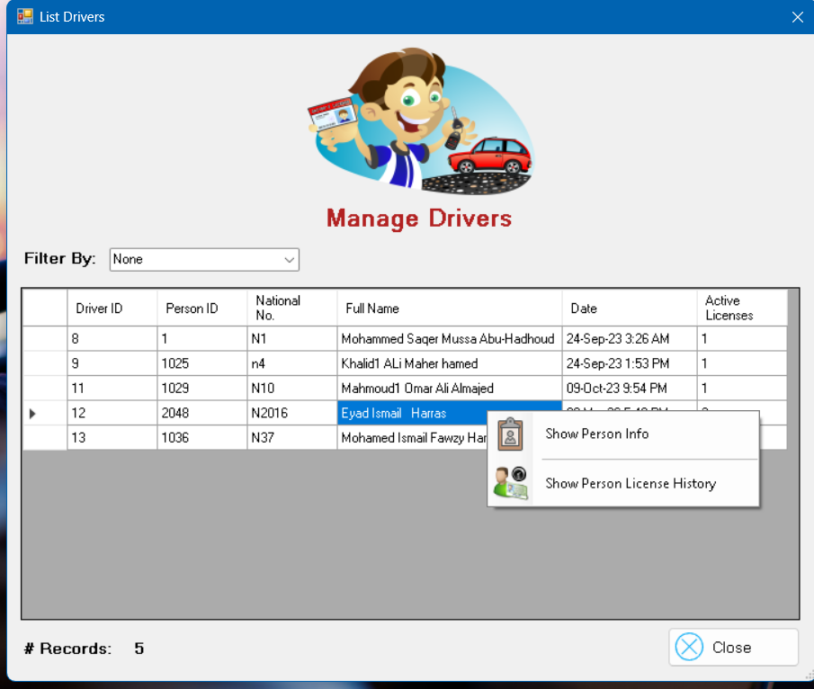 

---

### Tests:
- From here, the user can schedule a Test Appointment for an applicant
- With a data view for all past appointments and their results
- Also, the user can change the appointment date without any extra fees
- In taking the test form, the user put input results *(Pass or Fail)* and if there are any notes `like if he needs glasses, etc.`

#### Tests Appointments:
| Vision Test | Written Test | Street Test |
|-------------|--------------|-------------|
|  |  |  

| Schedule Test | Take Test | 
|---------------|-----------|
|  |  |

---

### Licenses:
- All Operations that can be done on a license, like:
- Issue for the first Time, show its info
- Issue Local License, or International License and the validations on them
- Detain License, then Release the Detained License
- Renew the license when it expires
- Replacement for both situations of damage or loss of the license
- Complex Logic behind the Local Driving License Application screen

#### Show Person License History & Issue for the first time:
| Local License History | International License History | 
|-----------------------|-------------------------------|
| 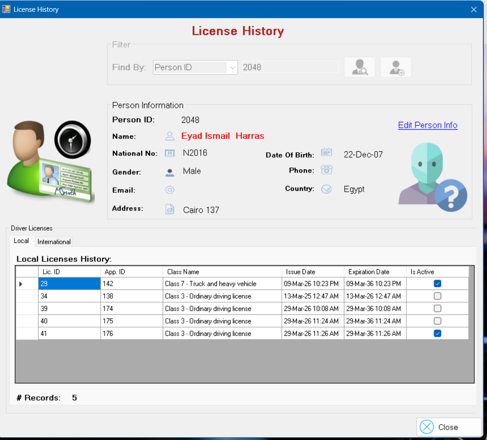 | 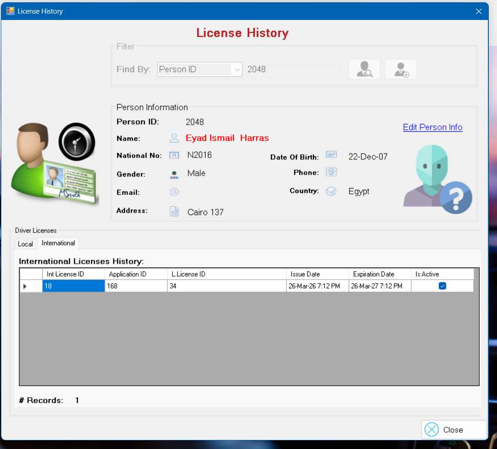 |

| Show Driver License Info | Issue License For First Time | 
|--------------------------|------------------------------|
| 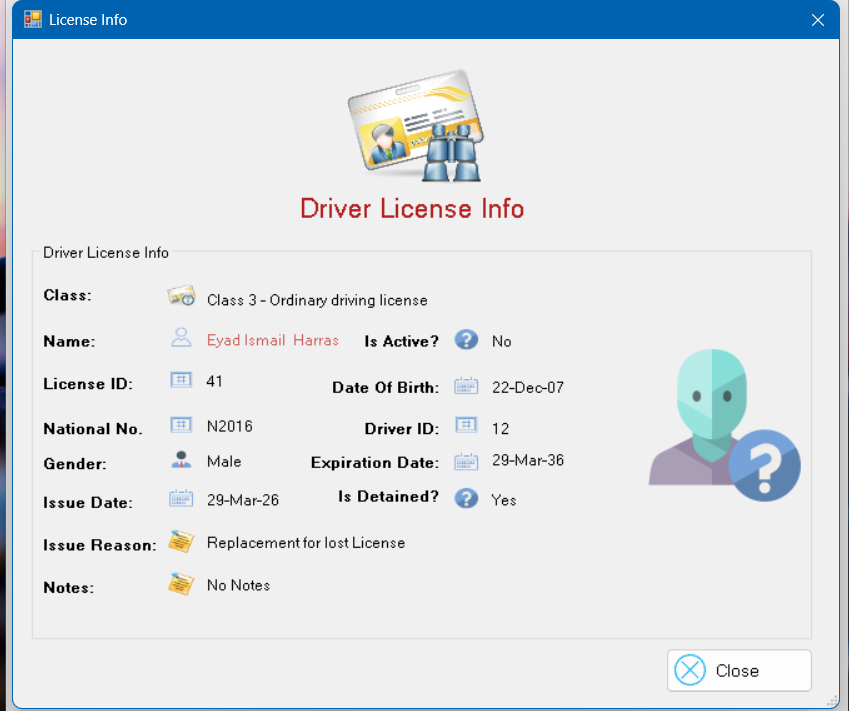 | 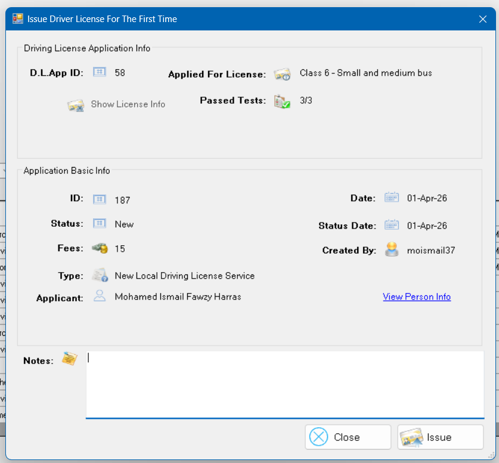 |

#### Renew (Validations) / Replacement for Damage or loss of License:
| Renew expired License | Replacement for Damage | Replacement for Loss |
|-----------------------|------------------------|----------------------|
| 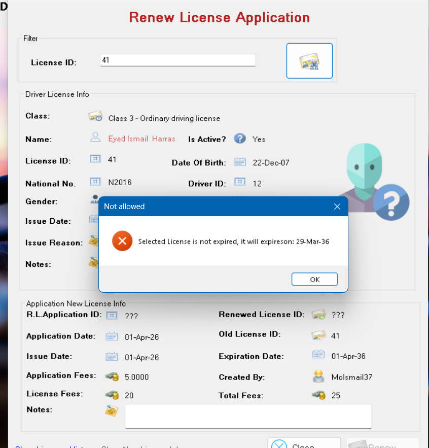 | 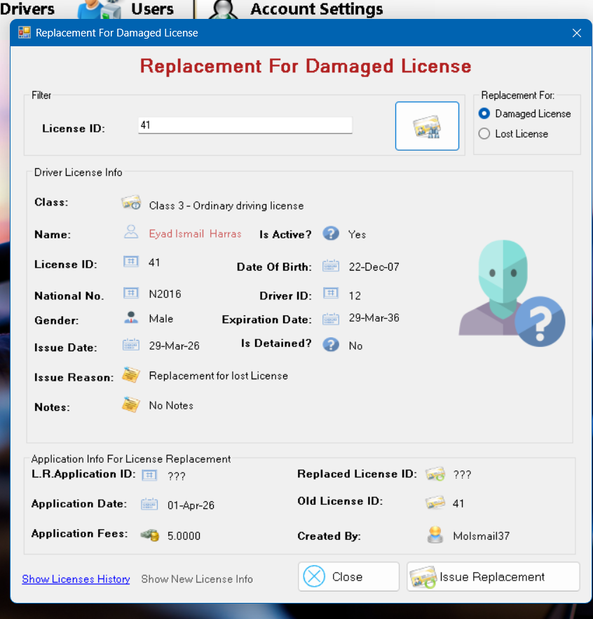 | 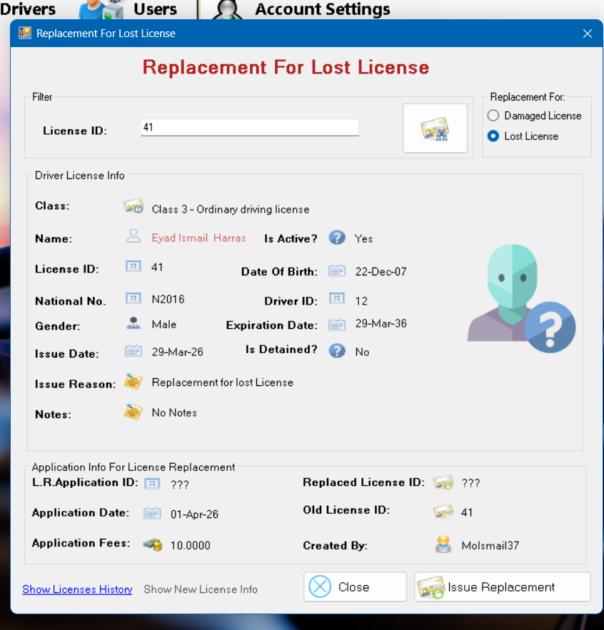 

#### International License:
| Issue Internationa License | Validations | 
|----------------------------|-------------|
|  |  |


#### Detain and Release Licenses:
| Detain License Screen | Success Detaining License | Release Detained License |
|-----------------------|---------------------------|--------------------------|
|  |  |  


| Manage Detained Licenses | Search with filters | 
|--------------------------|---------------------|
|  |  |

#### Local Driving License (applications):

| New Local Driving License App P1 | New Local Driving License App P2 | 
|----------------------------------|----------------------------------|
|  |  |

| Choose License Class | Authentication on License Class | 
|----------------------|---------------------------------|
|  |  |

| Manage Local Driving License Applications | Search with Filters | 
|-------------------------------------------|---------------------|
|  |  |

| Context Menu Stripe 1 | Context Menu Stripe 2 | Context Menu Stripe 3 |
|-----------------------|-----------------------|-----------------------|
|  |  |  


### Screenshots
You can place all screenshots inside a `/assets` folder

---
## Architecture & Database Design

The project follows the **3-Tier Architecture**:

1. **Presentation Layer (UI):**
   - Built with Windows Forms.
   - Handles all user interactions, such as buttons, forms, and validation on the UI tier.

2. **Business Logic Layer (BLL):**
   - Contains the core application logic and rules.
   - Validates data and ensures system consistency.
   - Acts as a bridge between the UI and the Data Access Layer.

3. **Data Access Layer (DAL):**
   - Uses ADO.NET to interact with SQL Server.
   - Responsible for all CRUD operations (Create, Read, Update, Delete).

This separation ensures:
- High maintainability
- Easier testing and debugging
- Clean, scalable codebase

### Database Design
- SQL Server database with **13 normalized tables**
- Proper use of:
  - Primary & Foreign Keys
  - NOT NULL & NULL constraints
  - Relationships between entities
- Designed following **database normal forms (1NF → 3NF)**

---
## Technical Highlights
- **3-Tier Architecture:** Separation of Presentation, Business Logic, and Data Access layers for maintainability and scalability.  
- **Full CRUD Operations:** Implemented for all core entities with proper validation and error handling.  
- **WinForms UI:** User-friendly desktop interface with DataGridViews, filtering, context menus, and masked input fields.  
- **ADO.NET & SQL Server:** Efficient database interactions, normalized tables, relationships, and constraints.  
- **Input Validation & Security:** Live validation in forms, type restrictions, masked passwords, and safe deletion logic.  
- **Reusable Components:** Custom controls for repeated UI patterns, such as PersonCardWithFilters.  
- **Structured File Organization:** Separate projects for Presentation, Business Logic, and Data Access layers.  
- **Scalable & Extensible:** Designed to allow adding new features or tables without major refactoring.  

---

## File Structure
                            
```text
Driving-Vehicle-Licenses-Department/
├── BusinessLogicLayer/       # Contains core business logic and rules
├── DataAccessLayer/          # Handles all database interactions using ADO.NET
├── DVLD/                     # Presentation layer with WinForms UI
├── assets/                   # Screenshots and images organized by feature
│   ├── Applications/
│   ├── People Management/
│   ├── Users Management/
│   └── Test Types/
├── README.md                 # Project documentation
```
---

## Future Enhancements

- [x] ~~Implemented **People Management** with add, update, delete, and search features~~
- [x] ~~Implemented **Users Management** with user creation, update, password change, and validation~~
- [x] ~~Implemented **Test Types** and **Application Types** management with full CRUD~~
- [x] ~~Created **SQL Server database** with 13 tables, proper normalization, and relationships~~
- [ ] Add **Deployment and Setup (Installation)** section
- [ ] Provide a deeper explanation of the **Database** with photos
- [ ] Add **Applications, Drivers, and License features**
- [ ] Create a **video explaining the program**
- [ ] Add the New features on **GitHub** and enhance the README and recheck for any grammar mistakes, etc. 

---

## Contributers

| Field    | Details |
|---------|---------|
| Name    | Mohamed Ismail |
| Email   | mohamedismailfh@gmail.com |
| LinkedIn | linkedin.com/in/mohamed-ismail-fh |
| GitHub  | https://github.com/mohamedismail37 |


