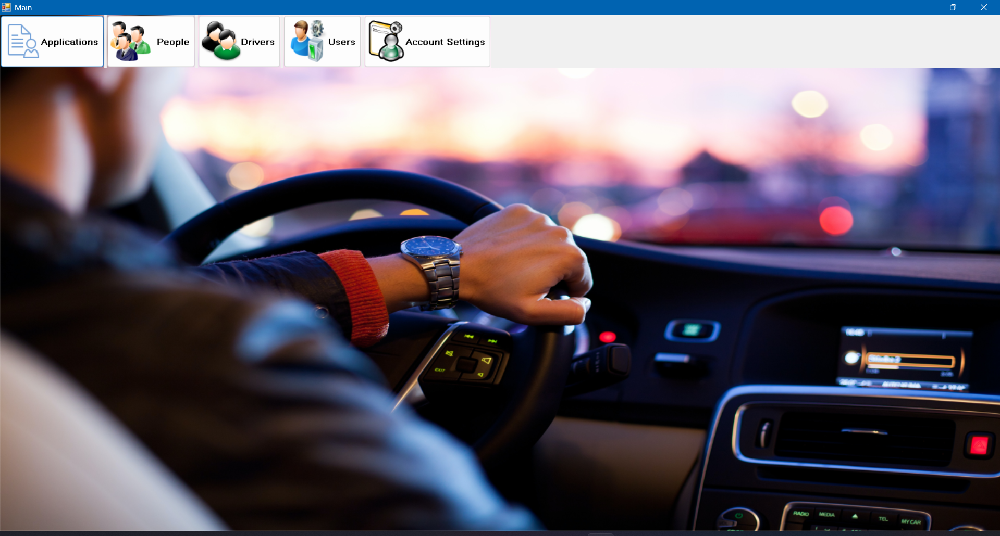
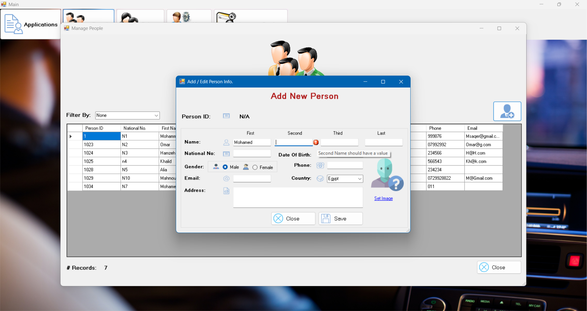

# Driving-Vehicle-Licenses-Department
The DVLD system is a C# (WinForms) and SQL Server desktop application designed to digitize driver and vehicle licensing operations. It follows a 3-tier architecture (Presentation, Business Logic, Data Access) and supports full CRUD operations for managing people, licenses, and vehicles.

---

## Architecture

The project follows the **3-Tier Architecture**:

1. **Presentation Layer (UI):**
   - Built with Windows Forms.
   - Handles all user interactions, such as buttons, forms, validation on the UI tier and DataGridViews.

2. **Business Logic Layer (BLL):**
   - Contains the core application logic and rules.
   - Validates data and ensures system consistency.
   - Acts as a bridge between the UI and the Data Access Layer.

3. **Data Access Layer (DAL):**
   - Uses ADO.NET to interact with SQL Server.
   - Responsible for all CRUD operations (Create, Read, Update, Delete).

---

## Main Features

### Main Page (Dashboard)

The main page serves as the system’s control panel, allowing users to quickly access all modules such as **Applications**, **People**, **Users**, **Drivers**, and **Licenses**.  
From here, administrators can open any section to perform management tasks efficiently.

---

### Manage People List and Filtering

The **Manage People** section provides a centralized dashboard displaying all registered individuals with options to **search**, **filter**, **update**, and **delete** records.  
Users can dynamically filter and search for people based on various fields such as **Name**, **National Number**, or other attributes, allowing for quick and efficient data access.

---

### Context List
A context menu for quick actions such as viewing details, editing, or deleting directly from the Manage People list.  

---

### Add New Person
Allows administrators to add new people to the database with live validation to avoid repeated unique attributes such as National Number.  

---

### Validation System
- Prevents saving empty textboxes.
- Performs live database validation for unique attributes.
- Displays error messages for invalid input.  

---

### Show Person Details
Displays complete personal information, including photo and contact details.  

---

### Update Person
Enables editing and updating existing records with validation and automatic UI refresh.  

---

## Technical Highlights

- 3-Tier Architecture (UI, BLL, DAL)
- Full CRUD Operations (Create, Read, Update, Delete)
- Data Validation and Error Handling
- Live Database Validation for Unique Fields
- Role-Based Access Control
- Image Handling and Storage
- Dynamic Search and Filtering
- Structured and Maintainable Codebase

---

## Technologies Used

- **Language:** C# (.NET Framework, WinForms)
- **Database:** Microsoft SQL Server
- **Architecture:** 3-Tier (Presentation, Business Logic, Data Access)
- **Libraries:** ADO.NET, System.Data, System.IO

---

## Screenshots

You can place all screenshots inside a `/Screenshots` folder:

