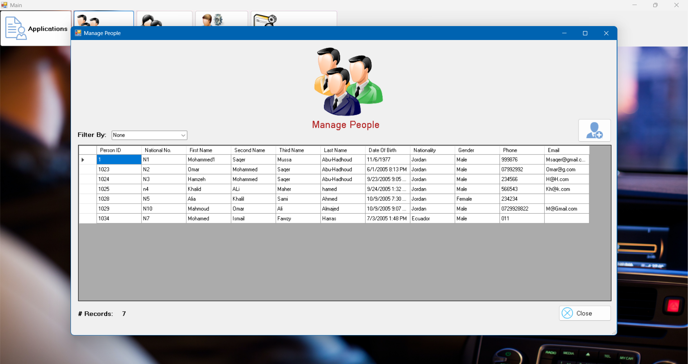
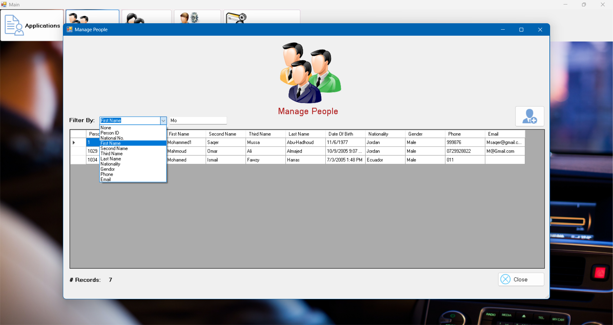
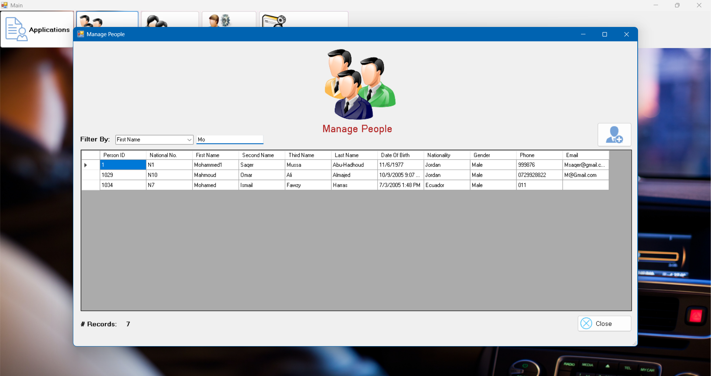
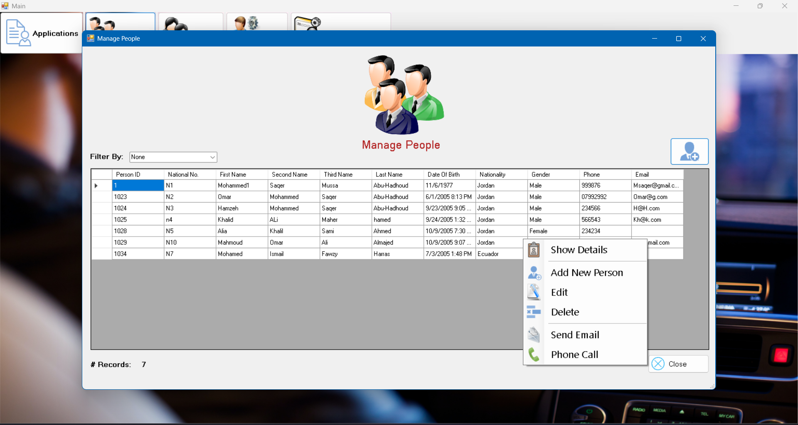
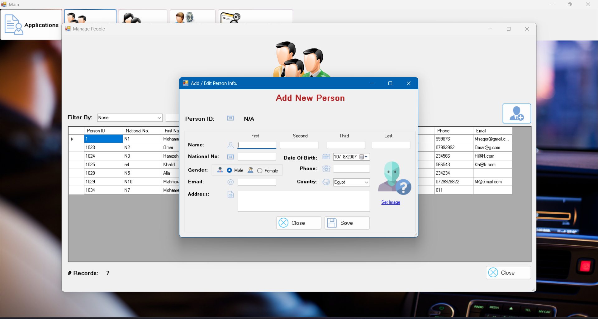
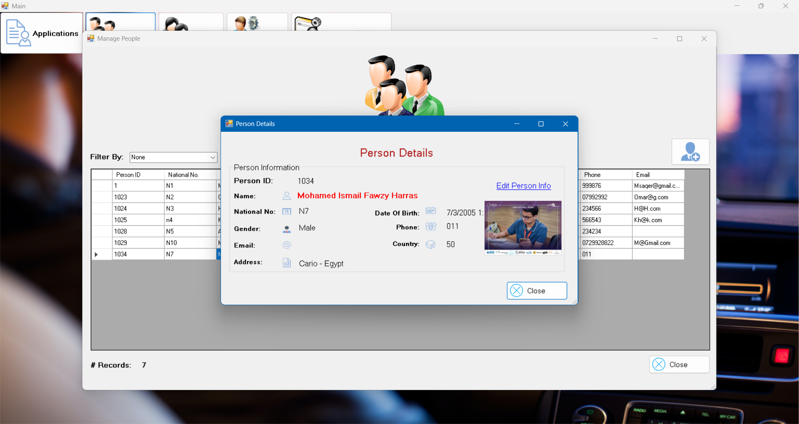
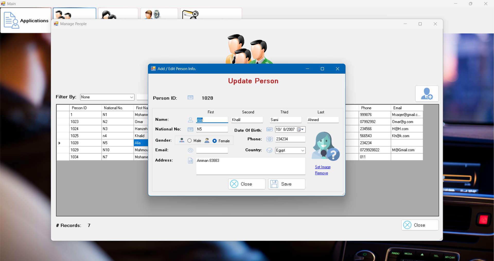

<h3 align="center">Driving Vehicle Licenses Department</h3>

### About The Project
> **DVLD** Developed a **C# .NET** Desktop application simulating real-world driver’s license issuance workflows

---
## Table of Contents

- [Project Description](#project-description)
  - [Overview](#overview)
  - [Objectives](#objectives)
  - [Built With](#built-with)
- [Main Features](#main-features)
- [Screenshots / UI Preview](#-screenshots--ui-preview)
- [Architecture & Database Design](#-architecture--database-design)
- [File Structure](#-file-structure)
- [Future Enhancements](#-future-enhancements)

---
## Project Description

### Overview
The Driving & Vehicle Licensing Department (DVLD) is a full-stack desktop application developed using C# and .NET Framework.  
The system simulates core workflows of a real-world licensing department, including people management, user management, applications, tests, etc.  
It is built with a clear focus on clean architecture, data validation, and maintainable code structure.

### Objectives
- Apply the **3-Tier Architecture** (Presentation, Business Logic, Data Access)
- Build a real-world–like system with **complete CRUD operations**
- Practice **WinForms UI development** with proper validation and user experience
- Design a **normalized SQL Server database** with relationships and constraints

### Built With
- **C# (.NET Framework)**
- **WinForms** 
- **ADO.NET**
- **SQL Server**
- **3-Tier Architecture**
- **Git & GitHub**

---
## Main Features

### Authentication & Account Management
- Secure login system with username & password validation
- Active user check before allowing access
- “Remember Me” functionality
- Change password with validation
- View current user information (without sensitive data)
- Logout functionality

| Login | Main Screen with account setting menu |
|-------|---------------------------------------|
|  |  | 

---
###  People Management
- View & List all people in a DataGridView
- Advanced filtering (Person ID, Name, Email, etc.)
- Input validation (letters-only for names, numbers-only for IDs)
- Context menu actions:
  - View person details
  - Update person information
  - Delete person (with safety checks)

| Manage People List | Context Menu |
|--------------------|--------------|
|  |  |

| All Filters | Filter applied |
|-------------|----------------|
|  |  |

| Show Person Card | Update Person Info |
|------------------|--------------------|
|  |  |

#### Add New Person:
| Validation for entities | Live validatoin with DB | 
|-------------------------|-------------------------|
|  |  |

---

### Manage People List and Filtering

The **Manage People** section provides a centralized dashboard displaying all registered individuals with options to **search**, **filter**, **update**, and **delete** records.  
Users can dynamically filter and search for people based on various fields such as **Name**, **National Number**, or other attributes, allowing for quick and efficient data access.

---

### Context List
A context menu for quick actions such as viewing details, editing, or deleting directly from the Manage People list.  

---

### Add New Person
Allows administrators to add new people to the database with live validation to avoid repeated unique attributes such as National Number.  

---

### Validation System
- Prevents saving empty textboxes.
- Performs live database validation for unique attributes.
- Displays error messages for invalid input.  

---

### Show Person Details
Displays complete personal information, including photo and contact details.  

---

### Update Person
Enables editing and updating existing records with validation and automatic UI refresh.  

---

## Architecture

The project follows the **3-Tier Architecture**:

1. **Presentation Layer (UI):**
   - Built with Windows Forms.
   - Handles all user interactions, such as buttons, forms, validation on the UI tier and DataGridViews.

2. **Business Logic Layer (BLL):**
   - Contains the core application logic and rules.
   - Validates data and ensures system consistency.
   - Acts as a bridge between the UI and the Data Access Layer.

3. **Data Access Layer (DAL):**
   - Uses ADO.NET to interact with SQL Server.
   - Responsible for all CRUD operations (Create, Read, Update, Delete).

---

## Technical Highlights

- 3-Tier Architecture (UI, BLL, DAL)
- Full CRUD Operations (Create, Read, Update, Delete)
- Data Validation and Error Handling
- Live Database Validation for Unique Fields
- Role-Based Access Control
- Image Handling and Storage
- Dynamic Search and Filtering
- Structured and Maintainable Codebase

---

## Technologies Used

- **Language:** C# (.NET Framework, WinForms)
- **Database:** Microsoft SQL Server
- **Architecture:** 3-Tier (Presentation, Business Logic, Data Access)
- **Libraries:** ADO.NET, System.Data, System.IO

---

## Screenshots

You can place all screenshots inside a `/assets` folder:

